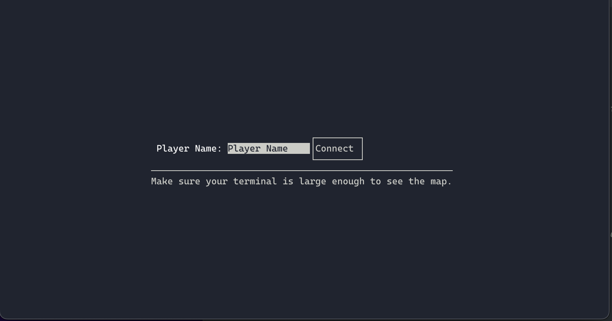
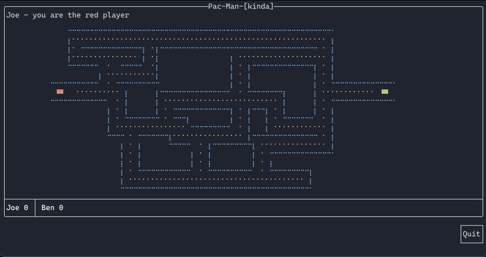
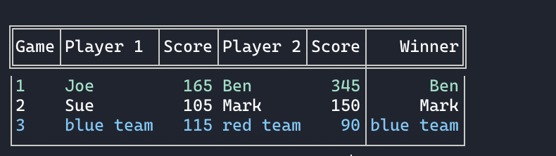

# CSS432_23W_Team404
Joe Berria 
CSS 432 Project

## <u>Description</u>
This is a simple Pac-Man like game. This doesn't implement all (or really even most) of the game mechanics of Pac-Man. Just a way to demonstrate socket programming. But if you stand far enough back and squint, it may look like Pac-Man!

## <u>Build</u>
This project will only run on macOS and Linux due to the use of the Berkeley  (posix) socket API. This project uses [FTXUI](https://github.com/ArthurSonzogni/FTXUI) for the terminal display. When you build for the first time, FTXUI will be fetched (by the makefile) and compiled in the build directory.
### To Build
>chmod +x build.sh 
>./buid.sh
 
### To Run
If there is no server running, you must run the server binary first
> ./build/Server  
> ./build/Game

## <u>Example</u>
### Starting the game you type in your name

### Game map

### History of all games on the server

